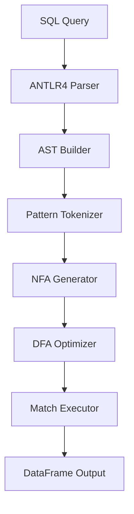

# SQL MATCH\_RECOGNIZE on Pandas

[](https://pypi.org/project/pandas-match-recognize/)
[](https://www.python.org/downloads/)
[](https://opensource.org/licenses/MIT)
[](https://github.com/MonierAshraf/Row_match_recognize)

A Python implementation of SQL's `MATCH_RECOGNIZE` clause for Pandas DataFrames. Run complex sequence detection and event-stream pattern queries in-memory — no external database required.

---

## Contents

- [Overview](#overview)
- [Motivation](#motivation)
- [Key Features](#key-features)
- [Architecture](#architecture)
- [Example SQL Query](#example-sql-query)
- [Quick Start](#quick-start)
- [API Reference](#api-reference)
- [Installation](#installation)
- [Uninstallation](#uninstallation)
- [Testing Functionality](#testing-functionality)
- [Development Setup](#development-setup)
- [Publishing a New Version](#publishing-a-new-version)
- [Troubleshooting](#troubleshooting)
- [Conclusion and Future Work](#conclusion-and-future-work)
- [References](#references)
- [Contributing](#contributing)
- [License](#license)

---

## Overview

`pandas-match-recognize` brings the SQL:2016 `MATCH_RECOGNIZE` standard directly to Pandas, supporting:

- `PARTITION BY` / `ORDER BY`
- Regex-style pattern syntax with quantifiers (`*`, `+`, `?`, `{n,m}`)
- `DEFINE` conditions with `PREV()`, `NEXT()`, `FIRST()`, `LAST()` navigation
- `AFTER MATCH SKIP` options
- Anchors, alternation, and `PERMUTE` patterns
- `ONE ROW PER MATCH` and `ALL ROWS PER MATCH` output modes

---

## Motivation

Existing platforms like Oracle, Trino, and Flink offer robust implementations of `MATCH_RECOGNIZE` but come with significant complexity, licensing, or deployment overhead. Python's Pandas, despite its widespread use, lacks direct support for expressive pattern queries.

This project aims to close that gap by enabling SQL-native pattern detection in Pandas without sacrificing performance or expressiveness.

---

## Key Features

| Feature | Details |
|---|---|
| **SQL Parsing** | ANTLR4-based grammar, extended from Trino's SQL dialect |
| **AST Construction** | Full abstract syntax tree for validation and execution |
| **Automata Engine** | NFA via Thompson's construction → DFA with state minimisation and prioritisation |
| **Pandas Execution** | Partition, order, match, and format results as a DataFrame |
| **Safe Evaluation** | SQL-to-Python via the `ast` module; custom error listeners for precise diagnostics |

---

## Architecture



---

## Example SQL Query

```sql
SELECT customer_id, start_price, bottom_price, final_price, start_date, final_date
FROM orders
MATCH_RECOGNIZE (
    PARTITION BY customer_id
    ORDER BY order_date
    MEASURES
        START.price           AS start_price,
        LAST(DOWN.price)      AS bottom_price,
        LAST(UP.price)        AS final_price,
        START.order_date      AS start_date,
        LAST(UP.order_date)   AS final_date
    ONE ROW PER MATCH
    AFTER MATCH SKIP PAST LAST ROW
    PATTERN (START DOWN+ UP+)
    DEFINE
        DOWN AS price < PREV(price),
        UP   AS price > PREV(price)
);
```

---

## Quick Start

The following Python code executes the V-shape pattern query shown above against a sample dataset.

```python
from pandas_match_recognize import match_recognize
import pandas as pd

data = [
    ('cust_1', '2020-05-11', 100),
    ('cust_1', '2020-05-12', 200),
    ('cust_2', '2020-05-13',   8),
    ('cust_1', '2020-05-14', 100),
    ('cust_2', '2020-05-15',   4),
    ('cust_1', '2020-05-16',  50),
    ('cust_1', '2020-05-17', 100),
    ('cust_2', '2020-05-18',   6),
]

df = pd.DataFrame(data, columns=['customer_id', 'order_date', 'price'])
df['order_date'] = pd.to_datetime(df['order_date'])

sql = """
SELECT customer_id, start_price, bottom_price, final_price, start_date, final_date
FROM orders
MATCH_RECOGNIZE (
    PARTITION BY customer_id
    ORDER BY order_date
    MEASURES
        START.price           AS start_price,
        LAST(DOWN.price)      AS bottom_price,
        LAST(UP.price)        AS final_price,
        START.order_date      AS start_date,
        LAST(UP.order_date)   AS final_date
    ONE ROW PER MATCH
    AFTER MATCH SKIP PAST LAST ROW
    PATTERN (START DOWN+ UP+)
    DEFINE
        DOWN AS price < PREV(price),
        UP   AS price > PREV(price)
);
"""

result = match_recognize(sql, df)
print(result)
```

**Output:**
```
  customer_id  start_price  bottom_price  final_price start_date  final_date
0      cust_1          200            50          100 2020-05-12  2020-05-17
1      cust_2            8             4            6 2020-05-13  2020-05-18
```

---

## API Reference

### `match_recognize(sql, df)`

Execute a `MATCH_RECOGNIZE` query against a Pandas DataFrame.

```python
from pandas_match_recognize import match_recognize
import pandas as pd

def match_recognize(sql: str, df: pd.DataFrame) -> pd.DataFrame: ...
```

| Parameter | Type | Description |
|---|---|---|
| `sql` | `str` | A SQL string containing a `MATCH_RECOGNIZE` clause. The `FROM` table name in the SQL maps to the supplied DataFrame. |
| `df` | `pd.DataFrame` | The input DataFrame to query. Must contain all columns referenced in `PARTITION BY`, `ORDER BY`, `MEASURES`, and `DEFINE`. |

**Returns:** `pd.DataFrame` — rows matching the specified pattern, projected and formatted according to the `MEASURES` clause and the selected output mode (`ONE ROW PER MATCH` or `ALL ROWS PER MATCH`).

**Raises:**
- `ValueError` — malformed SQL or undefined pattern variable referenced in `DEFINE` or `MEASURES`.
- `KeyError` — a column name referenced in the query does not exist in the DataFrame.

---

## Installation

### Requirements

- Python 3.8+
- pandas ≥ 1.0
- numpy ≥ 1.18
- antlr4-python3-runtime ≥ 4.9

### Install from PyPI (recommended)

```bash
pip install pandas-match-recognize
```

> **Package name vs import name:** pip uses a hyphen (`pandas-match-recognize`) while Python imports use an underscore (`pandas_match_recognize`). This follows standard Python packaging convention.
> ```python
> from pandas_match_recognize import match_recognize  # correct
> from pandas-match-recognize import match_recognize  # SyntaxError
> ```

### Upgrade to the latest version

```bash
pip install --upgrade pandas-match-recognize
```

### Install a specific version

```bash
pip install "pandas-match-recognize==0.2.3"  # replace with your target version
```

To list all available versions:
```bash
pip index versions pandas-match-recognize
```

### Editable install (local development)

Use this when you want source changes to take effect immediately without reinstalling:

```bash
git clone https://github.com/MonierAshraf/Row_match_recognize.git
cd Row_match_recognize
pip install -e .
```

With an editable install, `from pandas_match_recognize import match_recognize` resolves directly to your local source files. Any change takes effect after restarting your Python kernel or interpreter.

**Switch back to the published PyPI version at any time:**

```bash
pip install --force-reinstall pandas-match-recognize
```

### Verify installation

```bash
# Confirm the package imports correctly
python -c "from pandas_match_recognize import match_recognize; print('Installation successful')"

# Check the installed version
python -c "import pandas_match_recognize; print(pandas_match_recognize.__version__)"
```

For a more thorough check:

```python
# Run from outside the project directory to avoid local-file interference

try:
    from pandas_match_recognize import match_recognize
    print("pandas_match_recognize import: OK")
except ImportError as e:
    print(f"pandas_match_recognize import: FAILED — {e}")

import pandas as pd
df = pd.DataFrame({'a': [1, 2, 3], 'b': ['x', 'y', 'z']})
print("pandas integration: OK")
print("All checks passed — package is ready to use.")
```

### Installation troubleshooting

**Check installation source:**
```bash
pip show pandas-match-recognize
```

**Check available versions:**
```bash
pip index versions pandas-match-recognize
```

**Force reinstall (clears cache issues):**
```bash
pip uninstall pandas-match-recognize -y
pip install --no-cache-dir pandas-match-recognize
```

---

## Uninstallation

### Standard uninstall

```bash
pip uninstall pandas-match-recognize
```

### Remove an editable / development install

If you installed with `pip install -e .`, the standard uninstall may report *"No files were found to uninstall."*

```bash
# Step 1 — remove the package record
pip uninstall pandas-match-recognize -y

# Step 2 — remove build artefacts from the project directory
rm -rf build/ dist/ pandas_match_recognize.egg-info/

# Step 3 — (optional) clear pip's download cache
pip cache purge
```

### Complete cleanup (mixed or stubborn installs)

If the package persists after the steps above, locate and remove it from site-packages manually:

```bash
# Find installation paths
python -c "
import site, os, glob
site_packages = site.getsitepackages()[0]
patterns = [
    os.path.join(site_packages, 'pandas_match_recognize'),
    os.path.join(site_packages, 'pandas_match_recognize-*.dist-info'),
]
for pattern in patterns:
    for path in glob.glob(pattern):
        print(f'Found: {path}')
"
# Remove the directories printed above, for example:
# rm -rf /path/to/site-packages/pandas_match_recognize
# rm -rf /path/to/site-packages/pandas_match_recognize-*.dist-info
```

**Remove local build artefacts:**
```bash
rm -rf build/ dist/ *.egg-info/ __pycache__/ .pytest_cache/
```

### Verify removal

Always test from outside the project directory to avoid picking up local source files:

```bash
cd /tmp
python -c "
try:
    from pandas_match_recognize import match_recognize
    print('Package is still installed')
except ImportError:
    print('Package successfully removed')
"
```

### Uninstall troubleshooting

**"Can't uninstall. No files were found to uninstall."**

This is the most common issue with mixed installations (wheel + editable). Resolution:

```bash
# 1. Remove local development files from the project directory
rm -rf pandas_match_recognize.egg-info/ build/ dist/

# 2. Locate and remove from site-packages (see Complete Cleanup above)

# 3. Confirm removal
pip show pandas-match-recognize    # should print "Package(s) not found"

# 4. Test from outside the project directory
cd /tmp
python -c "from pandas_match_recognize import match_recognize" 2>/dev/null \
  && echo "Still installed" || echo "Successfully removed"
```

**Import works in the project directory but not elsewhere**

This is expected when no package is installed — Python finds the local `pandas_match_recognize/` folder. Test from `/tmp` or any other directory to confirm the installed package state.

**Package shows in pip list but can't be uninstalled**

```bash
pip show pandas-match-recognize
# If Location points to your project directory, it is a development install.
# Follow the "Remove an editable install" steps above.
```

**Multiple Python environments**

```bash
conda list | grep pandas-match-recognize      # Conda environments
pip list --user | grep pandas-match-recognize # User-level installs
```

---

## Testing Functionality

**Basic import and execution test:**

```python
from pandas_match_recognize import match_recognize
import pandas as pd

df = pd.DataFrame({
    'id':    [1, 1, 1, 2, 2],
    'value': [10, 20, 15, 5, 8],
    'time':  pd.date_range('2023-01-01', periods=5),
})

sql = """
SELECT id, value
FROM test_table
MATCH_RECOGNIZE (
    PARTITION BY id
    ORDER BY time
    MEASURES FIRST(A.value) AS first_val
    ONE ROW PER MATCH
    PATTERN (A)
    DEFINE A AS value > 0
)
"""

try:
    result = match_recognize(sql, df)
    print(f"Basic functionality test: PASSED (result shape: {result.shape})")
except Exception as e:
    print(f"Basic functionality test: FAILED — {e}")
```

---

## Development Setup

```bash
# 1. Fork the repository on GitHub, then clone your fork
git clone https://github.com/YOUR_USERNAME/Row_match_recognize.git
cd Row_match_recognize

# 2. Create an isolated virtual environment
python -m venv .venv
source .venv/bin/activate      # Windows: .venv\Scripts\activate

# 3. Install in editable mode with test dependencies
pip install -e .
pip install -r test_requirements.txt

# 4. Run the full test suite
python -m pytest \
  tests/test_anchor_patterns.py \
  tests/test_back_reference.py \
  tests/test_case_sensitivity.py \
  tests/test_complete_java_reference.py \
  tests/test_empty_cycle.py \
  tests/test_empty_matches.py \
  tests/test_exponential_protection.py \
  tests/test_fixed_failing_cases.py \
  tests/test_in_predicate.py \
  tests/test_match_recognize.py \
  tests/test_missing_critical_cases.py \
  tests/test_multiple_match_recognize.py \
  tests/test_navigation_and_conditions.py \
  tests/test_output_layout.py \
  tests/test_pattern_cache.py \
  tests/test_pattern_tokenizer.py \
  tests/test_permute_patterns.py \
  tests/test_production_aggregates.py \
  tests/test_scalar_functions.py \
  tests/test_sql2016_compliance.py \
  tests/test_subqueries.py \
  --tb=short
```

---

## Publishing a New Version

#### 1. Bump the version

Update the version string consistently in all four files:

- `setup.py` → `version="X.Y.Z"`
- `pyproject.toml` → `version = "X.Y.Z"`
- `pandas_match_recognize/__init__.py` → `__version__ = "X.Y.Z"`
- `match_recognize/__init__.py` → `__version__ = "X.Y.Z"`

Follow [Semantic Versioning](https://semver.org/):

| Change type | Example |
|---|---|
| Bug fix / patch | `0.2.1` → `0.2.2` |
| New feature (backwards-compatible) | `0.2.1` → `0.3.0` |
| Breaking change | `0.2.1` → `1.0.0` |

#### 2. Build and upload

```bash
# Remove previous build artefacts
rm -rf build/ dist/ *.egg-info/

# Build the distribution
python -m build

# (Optional) test locally before publishing
pip install dist/*.whl --force-reinstall

# Upload to PyPI
python -m twine upload dist/*
```

#### 3. Users upgrade

```bash
pip install --upgrade pandas-match-recognize
```

---

## Troubleshooting

**Import syntax — correct vs incorrect:**

```python
# Correct — use underscores in Python imports
from pandas_match_recognize import match_recognize

# Incorrect — hyphens are not valid Python identifiers
from pandas-match-recognize import match_recognize  # SyntaxError
```

**`ModuleNotFoundError` during development:**

```python
# If the package is not installed and you are running from the project root,
# add the source directory to the path as a temporary workaround:
import sys, os
sys.path.append(os.path.join(os.getcwd(), 'src'))
from executor.match_recognize import match_recognize

# The recommended approach is to install in editable mode instead:
# pip install -e .
# Then use: from pandas_match_recognize import match_recognize
```

**Performance issues on large datasets:**

- Use a `PARTITION BY` clause to limit the number of rows processed per partition.
- Avoid deeply nested patterns with multiple unbounded quantifiers (e.g., `(A+B*)+`), which can cause exponential automata growth.
- Target datasets up to ~1 000 rows per partition for optimal throughput.

**Memory usage:**

```bash
pip install psutil   # optional monitoring library
```
```python
import psutil
print(f"Memory usage: {psutil.virtual_memory().percent}%")
```

Patterns with many variables and complex quantifiers generate large automata. Use bounded quantifiers (`{n,m}`) where possible.

---

## Conclusion and Future Work

### Current Limitations

Despite the system's comprehensive capabilities, several limitations remain.

**Complex pattern and quantifier interactions:** although the system supports concatenation, alternation, grouping, and standard quantifiers (`*`, `+`, `?`, `{n,m}`), certain combinations — particularly multiple greedy quantifiers nested within groups (e.g., `(A+B*)+C?`) — can trigger exponential state-space growth during automata construction. This issue primarily arises with three or more levels of nesting combined with unbounded quantifiers; simpler patterns and bounded quantifiers behave efficiently.

**Limited support for user-defined aggregate functions:** while a wide range of built-in aggregates (including conditional and statistical functions) is supported, the current implementation offers only limited support for user-defined aggregate functions.

### Future Work

- **Performance on large datasets:** the system performs efficiently on moderate-sized datasets but may require additional optimisations for very large inputs.
- **Memory usage for large patterns:** patterns with many variables and complex quantifiers generate large automata, increasing memory consumption.
- **Integration with query optimisers:** because the pattern-matching engine currently operates independently of database query optimisers, it may miss plan-level optimisation opportunities.
- **Distributed processing:** integration with Dask or Spark for large-scale workloads.
- **Extended SQL:2016 clause coverage.**

### Conclusion

We presented a SQL-in-Pandas engine for executing `MATCH_RECOGNIZE` queries over DataFrames. This provides SQL:2016 `MATCH_RECOGNIZE` functionality for Pandas DataFrames, bridging the gap between the expressiveness of relational queries and the flexibility of in-memory analytics — bringing SQL pattern matching capabilities directly to Python data science workflows.

`MATCH_RECOGNIZE` allows data scientists and analysts to use powerful pattern-matching semantics within their familiar Pandas environment, without the need for complex Python code or external SQL engine dependencies. This reduces development complexity and enhances productivity for sequential data analysis across domains including financial analysis, log processing, and time-series pattern detection.

By addressing the identified limitations and implementing the planned enhancements, the goal is a more adaptable and efficient solution capable of handling complex pattern-matching scenarios across a variety of data processing environments.

---

## References

- [Oracle MATCH\_RECOGNIZE documentation](https://docs.oracle.com/cd/E29542_01/apirefs.1111/e12048/pattern_recog.htm#CQLLR1531)
- [Flink SQL MATCH\_RECOGNIZE](https://nightlies.apache.org/flink/flink-docs-release-1.15/docs/dev/table/sql/queries/match_recognize/)
- [Trino Row Pattern Recognition](https://trino.io/docs/current/sql/match-recognize.html)

---

## Contributing

Pull requests and issue reports are welcome. Please ensure contributions include tests and a brief description of the change.

- **Bug reports & feature requests:** [open an issue on GitHub](https://github.com/MonierAshraf/Row_match_recognize/issues)
- **Pull requests:** fork the repository, create a feature branch, and submit a PR against `main`

---

## License

MIT License — see [LICENSE](LICENSE) for details.
