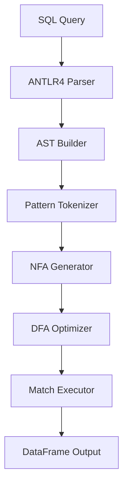

# SQL MATCH\_RECOGNIZE on Pandas

[](https://pypi.org/project/pandas-match-recognize/)
[](https://www.python.org/downloads/)
[](https://opensource.org/licenses/MIT)
[](https://github.com/MonierLawande/Row_match_recognize)
[](https://github.com/MonierLawande/Row_match_recognize/actions/workflows/cross-platform-tests.yml)

A Python implementation of SQL's `MATCH_RECOGNIZE` clause for Pandas DataFrames. Run complex sequence detection and event-stream pattern queries in-memory — no external database required.

Validated against Trino 473 and Oracle 21c EE on 30 pattern–size combinations, with 741 passing tests. See [Benchmarks](#benchmarks).

---

## Contents

- [Overview](#overview)
- [Motivation](#motivation)
- [Key Features](#key-features)
- [Architecture](#architecture)
- [Benchmarks](#benchmarks)
- [Supported Scope](#supported-scope)
- [Example SQL Query](#example-sql-query)
- [Quick Start](#quick-start)
- [API Reference](#api-reference)
- [Installation](#installation)
- [Uninstallation](#uninstallation)
- [Testing Functionality](#testing-functionality)
- [Development Setup](#development-setup)
- [Conclusion and Future Work](#conclusion-and-future-work)
- [References](#references)
- [About This Work](#about-this-work)
- [Contributing](#contributing)
- [License](#license)

---

## Overview

`pandas-match-recognize` brings the SQL:2016 `MATCH_RECOGNIZE` standard directly to Pandas, supporting:

- `PARTITION BY` / `ORDER BY`
- Regex-style pattern syntax with quantifiers (`*`, `+`, `?`, `{n,m}`)
- `DEFINE` conditions with `PREV()`, `NEXT()`, `FIRST()`, `LAST()` navigation
- `AFTER MATCH SKIP` options
- Anchors, alternation, and `PERMUTE` patterns
- `ONE ROW PER MATCH` and `ALL ROWS PER MATCH` output modes

---

## Motivation

Existing platforms like Oracle, Trino, and Flink offer robust implementations of `MATCH_RECOGNIZE` but come with significant complexity, licensing, or deployment overhead. Python's Pandas, despite its widespread use, lacks direct support for expressive pattern queries.

This project aims to close that gap by enabling SQL-native pattern detection in Pandas without sacrificing performance or expressiveness.

---

## Key Features

| Feature | Details |
|---|---|
| **SQL Parsing** | ANTLR4-based grammar, extended from Trino's SQL dialect |
| **AST Construction** | Full abstract syntax tree for validation and execution |
| **Automata Engine** | NFA via Thompson's construction → DFA with state minimisation and prioritisation |
| **Pandas Execution** | Partition, order, match, and format results as a DataFrame |
| **Safe Evaluation** | SQL-to-Python via the `ast` module; custom error listeners for precise diagnostics |

---

## Architecture


```mermaid
flowchart TD
    SQL[SQL Query]
    Parse[ANTLR4 Parser]
    AST[AST Builder]
    Tokenize[Pattern Tokenizer]
    NFA[NFA Generator]
    DFA[DFA Optimizer]
    Executor[Match Executor]
    Output[DataFrame Output]

    SQL --> Parse --> AST --> Tokenize --> NFA --> DFA --> Executor --> Output
```

---

## Benchmarks

The engine was measured against Trino 473 and Oracle 21c EE on the Amazon UK Products 2023 dataset: five pattern families across six sizes from 100 K to 2.22 M rows. Each system ran under the same limits — one CPU core and 32 GB — one system at a time. Every cell used five warm-ups and twenty measured runs, with outliers removed by the 1.5×IQR rule.

**All three systems returned the same results in all 30 pattern–size combinations.**

| | Proposed engine | Oracle 21c EE | Trino 473 |
|---|---:|---:|---:|
| Mean execution time | **0.17 s** | 1.04 s | 1.98 s |
| Relative to engine | 1× | 6.2× | 11.8× |
| Mean resident footprint | **232 MB** | 1 997 MB | 11 145 MB |
| Relative to engine | 1× | 8.6× | 48.1× |
| Peak query-time memory | 64.5 MB | 23.6 MB | 2.0 MB |

The last row is the trade-off, not a win. The compiled path builds whole-column masks and intermediate arrays, so its incremental query memory is the highest of the three — about 2.7× Oracle's. It buys the speed and the far smaller total footprint.

**Scalability.** A separate study on Amazon Reviews 2023 ran to 227.9 M rows under a 58 GB limit. The engine and Oracle completed all 35 cases; Trino completed 33. Execution time stayed close to linear across the range (R² = 0.9904–0.9997).

**Scope of the claim.** These numbers describe one workload — a single partition, in-memory input, and the supported subset below — on one machine. The systems have different execution models and measured process boundaries. Database tuning could change the gap.

---

## Supported Scope

The engine implements an evaluated **R010-style subset**: row pattern recognition in the `FROM` clause. Knowing the edges matters more than the feature list:

| Area | Status |
|---|---|
| `PARTITION BY`, `ORDER BY`, `MEASURES`, `PATTERN`, `DEFINE`, `SUBSET` | Supported |
| `ONE ROW PER MATCH` / `ALL ROWS PER MATCH` | Supported |
| All `AFTER MATCH SKIP` modes | Supported |
| `PREV`, `NEXT`, `FIRST`, `LAST` navigation | Supported |
| Quantifiers `*`, `+`, `?`, `{n,m}`, reluctant forms | Supported |
| Alternation, grouping, anchors, exclusions, PERMUTE | Supported |
| R020 (`MATCH_RECOGNIZE` in a `WINDOW` clause) | Not supported |
| User-defined aggregates | Limited |

---

## Example SQL Query

```sql
SELECT customer_id, start_price, bottom_price, final_price, start_date, final_date
FROM orders
MATCH_RECOGNIZE (
    PARTITION BY customer_id
    ORDER BY order_date
    MEASURES
        START.price           AS start_price,
        LAST(DOWN.price)      AS bottom_price,
        LAST(UP.price)        AS final_price,
        START.order_date      AS start_date,
        LAST(UP.order_date)   AS final_date
    ONE ROW PER MATCH
    AFTER MATCH SKIP PAST LAST ROW
    PATTERN (START DOWN+ UP+)
    DEFINE
        DOWN AS price < PREV(price),
        UP   AS price > PREV(price)
);
```

---

## Quick Start

The following Python code executes the V-shape pattern query shown above against a sample dataset.

```python
from pandas_match_recognize import match_recognize
import pandas as pd

data = [
    ('cust_1', '2020-05-11', 100),
    ('cust_1', '2020-05-12', 200),
    ('cust_2', '2020-05-13',   8),
    ('cust_1', '2020-05-14', 100),
    ('cust_2', '2020-05-15',   4),
    ('cust_1', '2020-05-16',  50),
    ('cust_1', '2020-05-17', 100),
    ('cust_2', '2020-05-18',   6),
]

df = pd.DataFrame(data, columns=['customer_id', 'order_date', 'price'])
df['order_date'] = pd.to_datetime(df['order_date'])

sql = """
SELECT customer_id, start_price, bottom_price, final_price, start_date, final_date
FROM orders
MATCH_RECOGNIZE (
    PARTITION BY customer_id
    ORDER BY order_date
    MEASURES
        START.price           AS start_price,
        LAST(DOWN.price)      AS bottom_price,
        LAST(UP.price)        AS final_price,
        START.order_date      AS start_date,
        LAST(UP.order_date)   AS final_date
    ONE ROW PER MATCH
    AFTER MATCH SKIP PAST LAST ROW
    PATTERN (START DOWN+ UP+)
    DEFINE
        DOWN AS price < PREV(price),
        UP   AS price > PREV(price)
);
"""

result = match_recognize(sql, df)
print(result)
```

**Output:**
```
  customer_id  start_price  bottom_price  final_price start_date  final_date
0      cust_1          200            50          100 2020-05-12  2020-05-17
1      cust_2            8             4            6 2020-05-13  2020-05-18
```

---

## API Reference

### `match_recognize(sql, df)`

Execute a `MATCH_RECOGNIZE` query against a Pandas DataFrame.

```python
from pandas_match_recognize import match_recognize
import pandas as pd

def match_recognize(sql: str, df: pd.DataFrame) -> pd.DataFrame: ...
```

| Parameter | Type | Description |
|---|---|---|
| `sql` | `str` | A SQL string containing a `MATCH_RECOGNIZE` clause. The `FROM` table name in the SQL maps to the supplied DataFrame. |
| `df` | `pd.DataFrame` | The input DataFrame to query. Must contain all columns referenced in `PARTITION BY`, `ORDER BY`, `MEASURES`, and `DEFINE`. |

**Returns:** `pd.DataFrame` — rows matching the specified pattern, projected and formatted according to the `MEASURES` clause and the selected output mode (`ONE ROW PER MATCH` or `ALL ROWS PER MATCH`).

**Raises:**
- `ValueError` — the SQL cannot be parsed. This covers malformed syntax, a pattern variable referenced in `MEASURES` but never defined, and `MATCH_RECOGNIZE` used in a `WINDOW` clause (R020).
- `RuntimeError` — a column named in `PARTITION BY` does not exist in the DataFrame.
- `OrderExpressionError` (subclass of `ValueError`) — an `ORDER BY` item names an unknown column, or uses a function or construct outside the supported set.

**Does not raise — returns an empty DataFrame instead:**
- A column named only in `DEFINE` that does not exist.
- A `DEFINE` condition outside the supported expression subset.

If a query returns no rows unexpectedly, check the `DEFINE` conditions first.

---

## Installation

### Requirements

- Python ≥ 3.8
- pandas ≥ 1.0.0, < 3.0
- numpy ≥ 1.18.0, < 2.2
- antlr4-python3-runtime ≥ 4.9.0
- psutil ≥ 5.8.0

All four packages are installed automatically by `pip`. The upper bounds on pandas and numpy are deliberate — they are the versions the test suite is verified against.

### Install from PyPI (recommended)

```bash
pip install pandas-match-recognize
```

> **Package name vs import name:** pip uses a hyphen (`pandas-match-recognize`) while Python imports use an underscore (`pandas_match_recognize`). This follows standard Python packaging convention.
> ```python
> from pandas_match_recognize import match_recognize  # correct
> from pandas-match-recognize import match_recognize  # SyntaxError
> ```

### Upgrade to the latest version

```bash
pip install --upgrade pandas-match-recognize
```

### Install a specific version

```bash
pip install "pandas-match-recognize==0.2.5"  # replace with your target version
```

To list all available versions:
```bash
pip index versions pandas-match-recognize
```

### Editable install (local development)

Use this when you want source changes to take effect immediately without reinstalling:

```bash
git clone https://github.com/MonierLawande/Row_match_recognize.git
cd Row_match_recognize
pip install -e .
```

With an editable install, `from pandas_match_recognize import match_recognize` resolves directly to your local source files. Any change takes effect after restarting your Python kernel or interpreter.

**Switch back to the published PyPI version at any time:**

```bash
pip install --force-reinstall pandas-match-recognize
```

### Verify installation

```bash
# Confirm the package imports correctly
python -c "from pandas_match_recognize import match_recognize; print('Installation successful')"

# Check the installed version
python -c "import pandas_match_recognize; print(pandas_match_recognize.__version__)"
```

Run this from **outside** the project directory, so Python cannot pick up the local source folder instead of the installed package.

### Installation troubleshooting

**Check installation source:**
```bash
pip show pandas-match-recognize
```

**Check available versions:**
```bash
pip index versions pandas-match-recognize
```

**Force reinstall (clears cache issues):**
```bash
pip uninstall pandas-match-recognize -y
pip install --no-cache-dir pandas-match-recognize
```

---

## Uninstallation

### Standard uninstall

```bash
pip uninstall pandas-match-recognize
```

### Remove an editable / development install

If you installed with `pip install -e .`, the standard uninstall may report *"No files were found to uninstall."*

```bash
# Step 1 — remove the package record
pip uninstall pandas-match-recognize -y

# Step 2 — remove build artefacts from the project directory
rm -rf build/ dist/ pandas_match_recognize.egg-info/

# Step 3 — (optional) clear pip's download cache
pip cache purge
```

### Complete cleanup (mixed or stubborn installs)

If the package survives the steps above, a copy is still sitting in `site-packages`. Locate it first:

```bash
# Where is it installed from?
pip show -f pandas-match-recognize | grep -i location

# Or ask Python directly
python -c "import pandas_match_recognize as m; print(m.__file__)"
```

Remove the package folder and its metadata sibling, then clear local build artefacts:

```bash
SITE=$(python -c "import site; print(site.getsitepackages()[0])")

rm -rf "$SITE"/pandas_match_recognize
rm -rf "$SITE"/pandas_match_recognize-*.dist-info

# In the project directory
rm -rf build/ dist/ *.egg-info/ .pytest_cache/
```

> On Windows, use `rmdir /s /q` instead of `rm -rf`, and read the path from `pip show` above.

### Verify removal

Always check from **outside** the project directory — inside it, Python finds the local source folder and the package looks installed when it is not:

```bash
cd /tmp

pip show pandas-match-recognize          # expect: Package(s) not found

python -c "import pandas_match_recognize" 2>/dev/null \
  && echo "Still installed" \
  || echo "Successfully removed"
```

### Uninstall troubleshooting

| Symptom | Cause | Fix |
|---|---|---|
| *"No files were found to uninstall"* | Mixed wheel + editable install | `rm -rf build/ dist/ *.egg-info/` then `pip uninstall pandas-match-recognize -y` |
| Import works in the project dir, fails elsewhere | Nothing is installed — Python is finding the local folder | Expected. Verify from `/tmp` |
| Shows in `pip list`, will not uninstall | `pip show` *Location* points at your project → editable install | `pip uninstall pandas-match-recognize -y`, then delete `*.egg-info/` |
| Removed, but still importable | Another environment still has it | `conda list \| grep pandas-match-recognize`<br>`pip list --user \| grep pandas-match-recognize` |
| Old version keeps coming back | Cached wheel | `pip cache purge` then reinstall with `--no-cache-dir` |

---

## Testing Functionality

**Basic import and execution test:**

```python
from pandas_match_recognize import match_recognize
import pandas as pd

df = pd.DataFrame({
    'id':    [1, 1, 1, 2, 2],
    'value': [10, 20, 15, 5, 8],
    'time':  pd.date_range('2023-01-01', periods=5),
})

sql = """
SELECT id, value
FROM test_table
MATCH_RECOGNIZE (
    PARTITION BY id
    ORDER BY time
    MEASURES FIRST(A.value) AS first_val
    ONE ROW PER MATCH
    PATTERN (A)
    DEFINE A AS value > 0
)
"""

try:
    result = match_recognize(sql, df)
    print(f"Basic functionality test: PASSED (result shape: {result.shape})")
    print(result)
except Exception as e:
    print(f"Basic functionality test: FAILED — {e}")
```

**Expected output:**
```
Basic functionality test: PASSED (result shape: (5, 2))
   id       value
0   1         10
1   1         20
2   1         15
3   2          5
4   2          8
```

`PATTERN (A)` matches a single row at a time, so every row that satisfies `DEFINE` becomes its own match — five rows in, five matches out.


---

## Development Setup

Fork the repository on GitHub, then set up a working copy:

```bash
git clone https://github.com/YOUR_USERNAME/Row_match_recognize.git
cd Row_match_recognize

python -m venv .venv
source .venv/bin/activate      # Windows: .venv\Scripts\activate

pip install -e ".[dev]"        # editable install + test tools
```

**Optional extras:**

```bash
pip install -e ".[performance]"   # polars, psutil, pyarrow — benchmark scripts only
```

### Running the tests

```bash
python -m pytest -q                                   # full suite — 741 tests
python -m pytest tests/test_sql2016_compliance.py -v  # one file, verbose
python -m pytest -k "permute or navigation"           # match test names
python -m pytest --collect-only -q | tail -1          # count without running
```

The plain `python -m pytest -q` is exactly what CI runs, on Ubuntu, Windows, and macOS against Python 3.8, 3.10, and 3.12. All 741 must pass before a pull request is merged.

### Project layout

| Path | Contents |
|---|---|
| `src/parser/` | ANTLR4 grammar and the `MATCH_RECOGNIZE` extractor |
| `src/ast_nodes/` | AST node definitions |
| `src/pattern/` | Pattern tokenizer, NFA/DFA construction, `PERMUTE` handling |
| `src/matcher/` | Condition evaluation and the matching engine |
| `src/executor/` | Partitioning, ordering, and result assembly |
| `tests/` | 37 test files |
| `Performance/` | Benchmark harness and plotting scripts |

### Working on the grammar

Changes under `src/grammar/` are generated from the ANTLR4 `.g4` sources. Regenerate them rather than editing the Python files by hand:

```bash
pip install antlr4-tools
antlr4 -Dlanguage=Python3 -visitor -o src/grammar src/grammar/*.g4
```

---


---

## Conclusion and Future Work

### Current Limitations

- **Nested greedy quantifiers:** combinations such as `(A+B*)+C?` can trigger exponential state-space growth during automata construction. This appears with three or more levels of nesting plus unbounded quantifiers; simpler patterns and bounded quantifiers behave efficiently.
- **User-defined aggregates:** a wide range of built-in aggregates is supported, including conditional and statistical ones, but user-defined aggregates only partially.

### Future Work

- **Memory at scale:** the input DataFrame stays resident, so RAM is the practical boundary. The engine reached 227.9 M rows without hitting an internal size limit, but the working set grows with the input.
- **Widening the compiled path:** the speed advantage is bounded by what the compiler turns into column operations. State-dependent `DEFINE` forms still fall back to the generic evaluator.
- **Query-optimiser integration:** the engine runs independently of a database planner, so it misses plan-level optimisation opportunities.
- **Distributed processing:** Dask or Spark for large-scale workloads.
- **Wider SQL:2016 coverage:** R020 (`MATCH_RECOGNIZE` in a `WINDOW` clause).

### Conclusion

This engine brings SQL:2016 `MATCH_RECOGNIZE` to Pandas DataFrames, bridging the expressiveness of relational queries with the flexibility of in-memory analytics. Analysts get pattern-matching semantics in their familiar environment, without hand-written state machines or an external SQL engine — which lowers development effort for sequential analysis in financial data, log processing, and time-series detection.

---

## References

- ISO/IEC 9075-2:2016 — *Information technology — Database languages — SQL — Part 2: Foundation*, which introduced row pattern recognition (features R010 and R020).
- [Oracle MATCH\_RECOGNIZE documentation](https://docs.oracle.com/cd/E29542_01/apirefs.1111/e12048/pattern_recog.htm#CQLLR1531)
- [Flink SQL MATCH\_RECOGNIZE](https://nightlies.apache.org/flink/flink-docs-release-1.15/docs/dev/table/sql/queries/match_recognize/)
- [Trino Row Pattern Recognition](https://trino.io/docs/current/sql/match-recognize.html)

---

## About This Work

This engine is the implementation behind a Master's thesis at Nile University, in the School of Information Technology and Computer Science.

The work was carried out under the supervision of **Prof. Mohamed El-Helw** and **Prof. Ahmed Awad**.

I owe a particular debt to Prof. Ahmed Awad, whose academic and technical guidance ran through every stage of this project — from the early design decisions to the shape of the final evaluation. He gave it a great deal of his time, and the engine is a good deal better for it.

I am also grateful to Prof. Mohamed El-Helw for his guidance and his steady support throughout, especially through the more difficult stretches of the work. Both supervisors shaped this project, and I am thankful to them.

### Our publications

The first paper on this work appeared at MELECON 2026:

> M. Lawande, M. El-helw, and A. Awad, "Row Pattern Recognition for Pandas: Bringing MATCH\_RECOGNIZE to Python DataFrames," in *2026 IEEE 23rd Mediterranean Electrotechnical Conference (MELECON)*, IEEE, 2026. doi: [10.1109/MELECON64486.2026.11418885](https://doi.org/10.1109/MELECON64486.2026.11418885)

```bibtex
@inproceedings{lawande2026rpr,
  title     = {Row Pattern Recognition for Pandas: Bringing
               {MATCH\_RECOGNIZE} to Python DataFrames},
  author    = {Lawande, Monier and El-helw, Mohamed and Awad, Ahmed},
  booktitle = {2026 IEEE 23rd Mediterranean Electrotechnical
               Conference (MELECON)},
  year      = {2026},
  publisher = {IEEE},
  doi       = {10.1109/MELECON64486.2026.11418885}
}
```

A second manuscript extending this work has been submitted to *Scientific Reports* and is currently **under review**. It carries the full cross-system evaluation against Trino and Oracle, the memory analysis, and the scalability study reported above. Details will be added here once it is published.

### Reference details

The full evaluation — cross-system correctness, the benchmarks above, and the scalability study — is documented in the thesis:

```bibtex
@mastersthesis{lawande2026rowmatch,
  author  = {Lawande, Monier},
  title   = {Row Pattern Matching Analytics: Bringing SQL
             {MATCH\_RECOGNIZE} to Pandas DataFrames},
  school  = {Nile University},
  address = {Giza, Egypt},
  year    = {2026},
  type    = {{MSc} thesis},
  note    = {School of Information Technology and Computer Science},
  url     = {https://github.com/MonierLawande/Row_match_recognize}
}
```

If this engine turns out to be useful in your own work, the MELECON paper above is the reference for it. For the software release itself, see [`pandas-match-recognize`](https://pypi.org/project/pandas-match-recognize/) on PyPI.

---

## Contributing

Pull requests and issue reports are welcome. Please ensure contributions include tests and a brief description of the change.

- **Bug reports & feature requests:** [open an issue on GitHub](https://github.com/MonierLawande/Row_match_recognize/issues)
- **Pull requests:** fork the repository, create a feature branch, and submit a PR against `master`
- **Before opening a PR:** run `python -m pytest -q` and confirm all 741 tests pass. CI runs the same suite on Ubuntu, Windows, and macOS against Python 3.8, 3.10, and 3.12.

---

## License

MIT License — see [LICENSE](LICENSE) for details.
